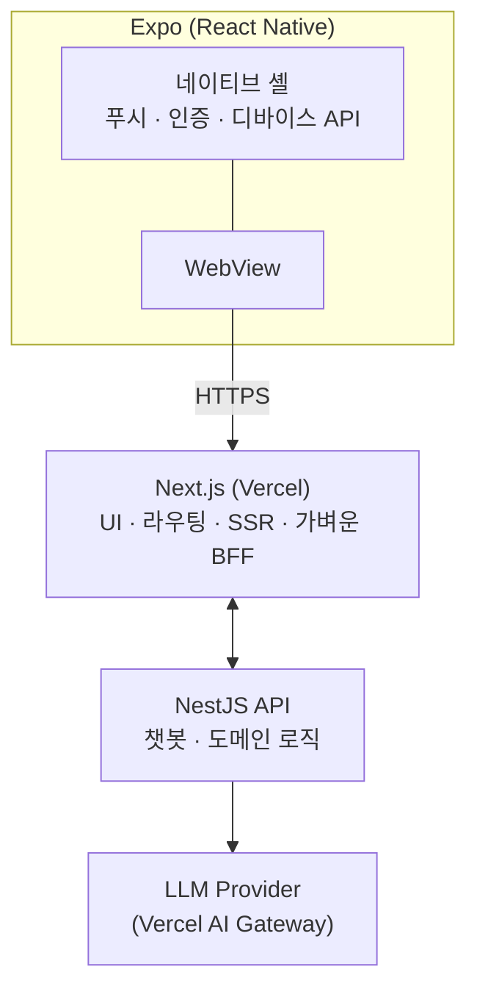

# Youth — Working Mom Dad

> **조직**: Youth (GitHub org: [`youth-corp`](https://github.com/youth-corp))
> **제품/앱 이름**: Working Mom Dad
> 본 레포([`working-mom-dad`](https://github.com/youth-corp/working-mom-dad))는 **워크스페이스 umbrella** — 큰 그림·레포 인덱스만 보관.
> 워킹맘/워킹대디를 위한 육아 정보 검색·기록 서비스.
> 사용자가 입력한 아이 정보(연령, 발달 단계, 알레르기 등)를 기반으로 AI 챗봇이 맞춤 답변을 제공한다.
> 현재 기획·디자인 초안 단계 (2026-05-04 기준).

---

## 제품 개요

- **타깃**: 워킹맘 / 워킹대디
- **핵심 기능**:
  1. 육아 정보 검색 (콘텐츠 큐레이션)
  2. 아이 성장·이벤트 기록
  3. 사용자 입력 정보 기반 AI 챗봇 상담
- **배포 형태**: RN(Expo) 앱 안에 Next.js 웹뷰를 띄우는 하이브리드 구조

---

## 아키텍처

### 역할 분담

- **Expo (RN)**: 네이티브 기능(푸시 알림, 카메라, 생체 인증, 딥링크), WebView 컨테이너
- **Next.js (Vercel)**: UI/UX 전반, 라우팅, 정적·SSR 페이지, 가벼운 BFF
- **NestJS**: 챗봇 오케스트레이션, 사용자/아이 정보 도메인, RAG·프롬프트 관리, 외부 LLM 호출

---

## 리포지토리 구성

워크스페이스(`/Users/anseongjin/Workspace/youth/`)는 **`youth-corp` 조직 산하 5개 레포**를 호스팅하는 상위 디렉토리다.
이 `CLAUDE.md`는 본 umbrella 레포에서 관리되며, 워크스페이스 루트에 심볼릭 링크로 노출된다.

| GitHub 레포 | 역할 | 스택 | 호스팅 |
|---|---|---|---|
| [`working-mom-dad`](https://github.com/youth-corp/working-mom-dad) (umbrella) | 워크스페이스 인덱스 (이 문서) | — | — |
| [`working-mom-dad-api`](https://github.com/youth-corp/working-mom-dad-api) | 도메인 API · 챗봇 · LLM 게이트웨이 (anchor) | NestJS, Prisma, TS | TBD |
| [`working-mom-dad-web`](https://github.com/youth-corp/working-mom-dad-web) | 사용자용 웹 (Expo WebView 타깃) | Next.js 16, Tailwind, TS | Vercel |
| [`working-mom-dad-admin`](https://github.com/youth-corp/working-mom-dad-admin) | 운영자 CMS | Next.js 16, Tailwind, TS | Vercel |
| [`working-mom-dad-mobile`](https://github.com/youth-corp/working-mom-dad-mobile) | RN 셸 (푸시·인증·WebView 컨테이너) | Expo, TS | EAS |

> 타입 공유는 별도 패키지 대신 **NestJS OpenAPI 스펙 → 클라이언트 코드젠**(web/admin/mobile)으로 처리.
> 도메인 스키마·아키텍처 상세는 **anchor 레포**(`working-mom-dad-api`)에 보관:
> - 레포 전략: [`docs/design/00-repo-strategy.md`](https://github.com/youth-corp/working-mom-dad-api/blob/main/docs/design/00-repo-strategy.md)
> - 도메인 스키마 11개: [`docs/schema/`](https://github.com/youth-corp/working-mom-dad-api/tree/main/docs/schema)

### Umbrella vs Anchor

- **Umbrella** (`working-mom-dad`): 워크스페이스 큰 그림, 레포 인덱스, 결정 사항 체크리스트. 작업 시작 시 가장 먼저 보는 곳.
- **Anchor** (`working-mom-dad-api`): 도메인 진실의 소스 — Prisma schema, 도메인 문서, OpenAPI 스펙 export. 코드 작업의 출발점.

---

## 기술 스택 결정 사항

- **언어**: TypeScript (전 영역, `strict: true`)
- **패키지 매니저**: pnpm
- **DB**: Supabase Postgres (Prisma로 스키마 컨트롤, API에 마스터)
- **ORM**: Prisma (API 단독 보유)
- **배포**:
  - 웹/어드민: Vercel (Next.js 16)
  - 앱: Expo EAS Build → 스토어 배포
  - API: 미정 (Fly.io 추천 — Supabase 같은 리전 배치)
- **AI**:
  - 클라이언트 SDK: Vercel AI SDK 검토
  - 모델 라우팅: Vercel AI Gateway 검토
- **상태 관리·UI**: 웹은 shadcn/ui + Tailwind 기준 검토

---

## 작업 원칙

- 각 레포의 세부 규칙은 해당 레포 `CLAUDE.md`에서 관리하고, 본 문서와 충돌하면 **레포 단위 문서가 우선**한다.
- 글로벌 코딩 컨벤션은 `~/.claude/CLAUDE.md` 참조 (TypeScript strict, kebab-case 파일명, Conventional Commits 등).
- 아키텍처 결정 사항(스택 변경, 레포 분리/병합 등)은 본 문서에 즉시 반영한다.

---

## 현재 상태 (2026-05-04)

- [x] 기획 초안
- [x] 디자인 초안
- [x] 레포 구조 확정 → anchor 레포(`working-mom-dad-api`)에 docs 통합 + umbrella 레포 추가
- [x] GitHub 레포 5개 생성 (umbrella + api/web/admin/mobile)
- [x] 4개 서비스 레포 메타 파일 셋업 + main 푸시
- [x] 인증 방식 확정 — **Supabase Auth**
- [x] **NestJS 11 본격 부트스트랩** (`@nestjs/cli new`)
- [x] **Next.js 16 웹 본격 부트스트랩** (Tailwind 4, App Router)
- [x] **Next.js 16 어드민 본격 부트스트랩** (Tailwind 4, App Router)
- [x] **Expo SDK 54 본격 부트스트랩** (expo-router)
- [ ] Supabase 프로젝트 생성 (dev) ← 사용자 진행 중
- [ ] NestJS 호스팅 결정 (Fly.io 추천 / Railway / Render)
- [ ] Prisma 스키마 작성 (`docs/schema/` → `prisma/schema.prisma`)
- [ ] Supabase Auth Guard 구현 (NestJS)
- [ ] OpenAPI 스펙 export + 클라이언트 코드젠 (web/admin/mobile)
- [ ] Vercel 프로젝트 연결 (web/admin)
