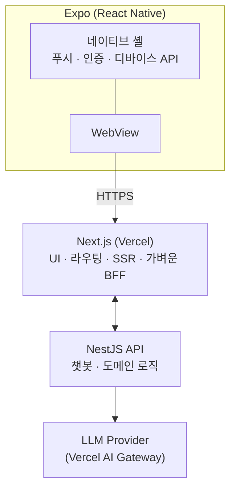

# 육아밸 (yougabell)

> **GitHub 조직**: [`four-lovely-fairies`](https://github.com/four-lovely-fairies)
> **제품/앱 이름**: 육아밸 (영문 식별자: `yougabell`)
> 본 레포([`yougabell`](https://github.com/four-lovely-fairies/yougabell))는 **워크스페이스 umbrella** — 큰 그림·레포 인덱스만 보관.
> 워킹맘/워킹대디를 위한 육아 정보 검색·기록 서비스.
> 사용자가 입력한 아이 정보(연령, 발달 단계, 알레르기 등)를 기반으로 AI 챗봇이 맞춤 답변을 제공한다.
> 현재 기획·디자인 초안 단계 (2026-05-06 기준).

---

## 제품 개요

- **타깃**: 워킹맘 / 워킹대디
- **핵심 기능**:
  1. 육아 정보 검색 (콘텐츠 큐레이션)
  2. 아이 성장·이벤트 기록
  3. 사용자 입력 정보 기반 AI 챗봇 상담
- **배포 형태**: RN(Expo) 앱 안에 Next.js 웹뷰를 띄우는 하이브리드 구조

---

## 아키텍처



### 역할 분담

- **Expo (RN)**: 네이티브 기능(푸시 알림, 카메라, 생체 인증, 딥링크), WebView 컨테이너
- **Next.js (Vercel)**: UI/UX 전반, 라우팅, 정적·SSR 페이지, 가벼운 BFF
- **NestJS**: 챗봇 오케스트레이션, 사용자/아이 정보 도메인, RAG·프롬프트 관리, 외부 LLM 호출

---

## 리포지토리 구성

워크스페이스 루트(예: `~/Workspace/youth/`)는 **`four-lovely-fairies` 조직 산하 5개 레포**를 호스팅하는 상위 디렉토리다.
이 `AGENTS.md`(+ 얇은 `CLAUDE.md`)는 본 umbrella 레포에서 관리되며, 워크스페이스 루트에 심볼릭 링크로 노출된다 (셋업 가이드는 [`README.md`](./README.md)).

| GitHub 레포                                                                   | 역할                                        | 스택                     | 호스팅 |
| ----------------------------------------------------------------------------- | ------------------------------------------- | ------------------------ | ------ |
| [`yougabell`](https://github.com/four-lovely-fairies/yougabell) (umbrella)    | 워크스페이스 인덱스 (이 문서)               | —                        | —      |
| [`yougabell-api`](https://github.com/four-lovely-fairies/yougabell-api)       | 도메인 API · 챗봇 · LLM 게이트웨이 (anchor) | NestJS, Prisma, TS       | TBD    |
| [`yougabell-web`](https://github.com/four-lovely-fairies/yougabell-web)       | 사용자용 웹 (Expo WebView 타깃)             | Next.js 16, Tailwind, TS | Vercel |
| [`yougabell-admin`](https://github.com/four-lovely-fairies/yougabell-admin)   | 운영자 CMS                                  | Next.js 16, Tailwind, TS | Vercel |
| [`yougabell-mobile`](https://github.com/four-lovely-fairies/yougabell-mobile) | RN 셸 (푸시·인증·WebView 컨테이너)          | Expo, TS                 | EAS    |

> 타입 공유는 별도 패키지 대신 **NestJS OpenAPI 스펙 → 클라이언트 코드젠**(web/admin/mobile)으로 처리.
> 도메인 스키마·아키텍처·기능 기획 문서는 **본 umbrella 레포**(`yougabell`)에서 관리:
>
> - 레포 전략: [`docs/design/00-repo-strategy.md`](./docs/design/00-repo-strategy.md)
> - 도메인 스키마 11개: [`docs/schema/`](./docs/schema)
> - 기능 기획: [`docs/features/`](./docs/features) — 본 디렉토리에서 기획 후 각 레포에서 구현

### Umbrella vs Anchor

- **Umbrella** (`yougabell`): **기획·결정의 진실의 소스**. 워크스페이스 큰 그림, 레포 인덱스, 결정 체크리스트, 도메인 스키마·레포 전략 문서, 기능 기획 (`docs/features/`). 작업 시작 시 가장 먼저 보는 곳.
- **Anchor** (`yougabell-api`): **구현(코드)의 진실의 소스**. Prisma schema 코드, OpenAPI 스펙 export, 도메인 백엔드 코드. umbrella 기획서 → 본 레포에서 구현.

---

## 기술 스택 결정 사항

- **언어**: TypeScript (전 영역, `strict: true`)
- **패키지 매니저**: pnpm
- **DB**: Supabase Postgres (Prisma로 스키마 컨트롤, API에 마스터)
- **ORM**: Prisma (API 단독 보유)
- **배포**:
  - 웹/어드민: Vercel (Next.js 16)
  - 앱: Expo EAS Build → 스토어 배포
  - API: 미정 (Fly.io 추천 — Supabase 같은 리전 배치)
- **AI**:
  - 클라이언트 SDK: Vercel AI SDK 검토
  - 모델 라우팅: Vercel AI Gateway 검토
- **상태 관리·UI**: 웹은 shadcn/ui + Tailwind 기준 검토

---

## 작업 원칙

### 컨벤션 계층

좁은 범위가 넓은 범위를 덮어쓴다. 충돌 시 **아래로 갈수록 우선**.

1. **글로벌** — `~/.claude/CLAUDE.md` (TypeScript strict, kebab-case, Conventional Commits 등 전 프로젝트 공통)
2. **워크스페이스** — 본 umbrella `AGENTS.md` (5개 레포 공통 규칙·아키텍처 결정)
3. **레포** — 각 레포 `AGENTS.md` (도메인·스택별 특수 규칙)
4. **디자인** — `DESIGN.md` (web/admin/mobile만, 토큰·컴포넌트 룰)

### 레포 의존 그래프

```
yougabell-api (anchor — 도메인 진실의 소스)
  ├─ Prisma schema   → DB 마이그레이션 (api 단독 보유)
  ├─ OpenAPI spec    → 클라이언트 코드젠 (web · admin · mobile)
  └─ Supabase Auth   → 토큰 검증 Guard

yougabell-web ──── HTTPS ────┐
yougabell-admin ──── HTTPS ──┤──→ yougabell-api
                             │
yougabell-mobile (Expo)      │
  └─ WebView ──→ yougabell-web ──→ (위 흐름)
  └─ 네이티브 (푸시·딥링크) ────────→ yougabell-api
```

- **anchor(`yougabell-api`)는 모든 도메인 작업의 시작점.** 타입·계약을 여기서 export.
- 클라이언트 3개는 codegen 산출물을 **수정 금지** (생성 파일 명시 + `.gitattributes`로 diff 무시 검토).
- mobile은 web에 WebView로 의존 — 네이티브 ↔ web 메시지 프로토콜은 `yougabell-mobile/AGENTS.md`에 명시.

### 크로스 레포 작업 흐름

| 변경 종류                         | 시작 위치                                               | 후속 작업                                                                         |
| --------------------------------- | ------------------------------------------------------- | --------------------------------------------------------------------------------- |
| 새 기능 (사용자 시나리오 동반)    | umbrella `docs/features/YYYYMMDD-<slug>.md`             | 기획 → 영향받는 레포별 작업 분해 → api 우선 구현 → 클라이언트 추가                |
| 도메인 모델 추가/수정             | umbrella `docs/schema/` (의미)                          | Prisma migrate (api `prisma/schema.prisma`) → OpenAPI export → 클라이언트 codegen |
| API 엔드포인트 추가               | umbrella `docs/features/` (계약 정의) → `yougabell-api` | OpenAPI export → web/admin/mobile 사용 코드 추가                                  |
| UI 디자인 토큰 변경               | `yougabell-web/DESIGN.md` (또는 admin)                  | DESIGN.md 갱신 → 컴포넌트 반영 → mobile 동기화 검토                               |
| 인증 정책 변경                    | `yougabell-api` (Supabase Auth Guard)                   | web/admin 미들웨어 → mobile 토큰 재발급 흐름                                      |
| 푸시·딥링크 페이로드              | `yougabell-mobile`                                      | 페이로드 스키마 합의 → `yougabell-api` 발송 모듈                                  |
| 워크스페이스 결정(스택·레포 변경) | 본 umbrella `AGENTS.md`                                 | 영향받는 레포 `AGENTS.md`에 링크 백                                               |

원칙: **기획은 umbrella에서 → 도메인 구현은 anchor(`yougabell-api`)에서 → 클라이언트로 전파**.

### 레포 간 참조 규칙

- 다른 레포 파일을 참조할 때는 **GitHub URL 절대 경로** 사용 — 각 레포는 독립 클론 가능하므로 상대 경로 가정 불가
  - 예: `https://github.com/four-lovely-fairies/yougabell/tree/main/docs/schema/`
- 워크스페이스 루트(`~/Workspace/youth/`) 기준 상대 경로는 **로컬 셋업 가이드(`README.md`)에서만** 사용
- 본 문서가 단일 진실인 항목(스택 결정, 레포 인덱스, 작업 원칙)은 각 레포 `AGENTS.md`에서 **링크로 참조**, 내용 복제 금지

### 에이전트 협업 (Claude Code / Codex / Cursor)

- 모든 에이전트는 **동일한 `AGENTS.md`를 단일 진실로 읽음** — Claude Code는 `CLAUDE.md`의 `@AGENTS.md`로 import, Codex는 직접 로드
- 컨벤션·아키텍처 변경 시 **`AGENTS.md`만 수정** (CLAUDE.md는 import 래퍼라 손대지 않음)
- **모든 변경(단일·다중 에이전트 무관)은 main 직접 push 금지** — 반드시 branch 분리 + PR로 원격 반영 (2026-05-17 사용자 확정).
  - 흐름: 변경 → 기능별 그룹핑 commit → `git push -u origin <branch>` → `gh pr create` → 사용자 확인 후 `gh pr merge --merge --delete-branch`
  - 단일 typo·comment 수준 미세 변경도 branch가 안전. main 직접 push는 PR 단위 추적·롤백을 깨뜨림
  - 동일 레포에서 여러 에이전트 동시 작업 시 더더욱 — 작업은 **기능별 브랜치** 분리, 커밋은 **기능별 그룹핑**(전체 묶음 commit 금지), 통합은 PR 단위
- Codex는 Claude Code의 Skill 자동 트리거 메커니즘이 없음 — 공통 워크플로우는 **`AGENTS.md`에 직접 서술**해 양쪽이 동일하게 따르도록 함

### 결정 사항 반영

- 아키텍처 결정(스택 변경, 레포 분리/병합, 인증 방식 등)은 **즉시 본 문서**에 반영하고 "현재 상태" 체크리스트 동시 갱신
- 레포 단위 결정은 해당 레포 `AGENTS.md`에 반영하되, 전사적 영향이 있으면 본 문서에서도 한 줄 링크로 언급

### 문서 포매팅

- 모든 `.md` 파일 작성/수정 후 **반드시 `pnpm prettier --write <file>`** 실행 — 에이전트(Claude Code · Codex)도 동일 적용
- 각 레포는 루트에 `.prettierrc`(또는 `prettier.config.js`) 공유 — 워크스페이스 공통 룰 유지(prose-wrap, line-width 등)
- prettier 미설치 레포는 **셋업 시 즉시 추가** (`pnpm add -D prettier`)
- markdown 외 코드 파일도 동일 — 커밋 전 포매팅이 기본값

---

## 에이전트 파일 구조 (AGENTS.md / CLAUDE.md / DESIGN.md)

**5개 레포 모두 동일 패턴**으로 구성. Codex/Claude Code/Cursor 등 모든 AI 코딩 에이전트가 동일 컨텍스트를 받도록 단일 소스 유지.

| 파일                    | 역할                                                                            | 누가 읽음                                      |
| ----------------------- | ------------------------------------------------------------------------------- | ---------------------------------------------- |
| `AGENTS.md`             | **단일 진실의 소스** — 스택, 빌드, 디렉토리, 핵심 원칙. Linux Foundation 표준   | Codex, Cursor, Aider, Copilot 등 직접          |
| `CLAUDE.md`             | `@AGENTS.md` (+ 디자인 레포는 `@DESIGN.md`) **import만** 하는 얇은 래퍼         | Claude Code (`@import` 확장 후 동일 내용 로드) |
| `DESIGN.md`             | 디자인 토큰·컴포넌트·작성 룰. **web/admin/mobile만 존재** (api/umbrella는 없음) | Figma MCP 연결 후 동기화                       |
| `.claude/settings.json` | 프로젝트 공유 Claude Code 설정 자리. 빈 `{}`                                    | Claude Code                                    |
| `.codex/config.toml`    | 프로젝트 공유 Codex 설정 자리. `~/.codex/config.toml` 상속                      | Codex                                          |

**`.gitignore`에 공통 ignore 패턴**:

```
.claude/settings.local.json
.claude/.credentials.json
.codex/auth.json
.codex/history.jsonl
.codex/sessions/
.codex/logs/
```

**컨벤션 변경 시**: AGENTS.md만 수정. CLAUDE.md는 import만 하므로 안 건드림.

---

## 레포별 추천 스킬 (Claude Code)

각 레포 작업 시 자주 트리거되는 Claude Code 스킬·MCP 도구. **Codex는 동등 자동 트리거 없음** → 동일 작업을 할 때는 각 레포 `AGENTS.md`에 명시된 절차·docs 링크를 따른다.

스킬은 보조 도구일 뿐이며, **단일 진실은 항상 `AGENTS.md` + 공식 docs**. 스킬 출력이 본 문서·각 레포 규칙과 충돌하면 문서가 우선.

### `yougabell-api` (NestJS 11 · Prisma 7 · Supabase · LLM)

- `vercel-storage` — Supabase Postgres 연결, 환경변수 패턴
- `ai-sdk` · `ai-gateway` — 챗봇 LLM 호출, 모델 라우팅·페일오버
- `workflow` — 장시간 챗봇 작업, 단계별 재시도
- `vercel-queues` — 알림 발송, 비동기 이벤트 fan-out
- `claude-api` — Anthropic SDK 직접 사용 시 (캐싱·thinking)

### `yougabell-web` (Next.js 16 · Tailwind 4 · shadcn/ui)

- `nextjs` — App Router, Server Components, Server Actions
- `next-cache-components` — PPR, `use cache`, `cacheLife` / `cacheTag`
- `next-upgrade` — 메이저 마이그레이션·codemod
- `shadcn` — 컴포넌트 추가/구성, 테마
- `ai-sdk` · `ai-elements` — 챗봇 UI (메시지 파트, 스트리밍, 도구 호출 표시)
- `react-best-practices` — TSX 다중 편집 후 자동 리뷰
- `turbopack` — 빌드·HMR 디버깅
- `figma:figma-implement-design` — Figma URL 받았을 때 코드 변환

### `yougabell-admin` (Next.js 16 · Tailwind 4 · shadcn/ui)

- `nextjs` · `shadcn` · `react-best-practices` — web과 동일
- `vercel-flags` — 운영 토글, 점진적 롤아웃, A/B
- `auth` — 운영자 권한 가드 (Clerk/Descope/Auth0 검토 시)
- `figma:figma-implement-design` — 운영 화면 구현

### `yougabell-mobile` (Expo SDK 54)

- 전용 Vercel 스킬 없음 — Expo 공식 docs + 레포 `AGENTS.md` 우선
- WebView ↔ 네이티브 메시지 프로토콜은 레포 `AGENTS.md`에서 단일 정의
- 챗봇 화면이 web에 있을 경우 `ai-sdk` 참고 (web에서 처리)

### `yougabell` (umbrella · 본 레포)

- 자동 트리거 스킬 거의 없음
- 결정 사항·커밋 흐름은 본 문서 + `~/.claude/CLAUDE.md` 글로벌 규칙
- 레포 간 작업 분배·체크리스트 갱신이 주 업무

---

## 커밋 메시지 규칙

- **Conventional Commits 형식 + 한글**:
  - prefix(`feat:`, `fix:`, `chore(scope):` 등)와 scope는 영어 식별자 유지
  - 제목·본문은 한글
- **scope**는 보통 레포 이름 short form 또는 모듈 이름 — `feat(api):`, `chore(web):`, `refactor(mobile):`
- Claude 협력 문구는 절대 포함 금지 (글로벌 컨벤션과 동일)
- 파일은 한 번에 다 묶지 말고 **기능별로 그룹핑해서 커밋**

**예시**:

```
feat(api): Prisma 스키마에 마음 케어 모듈 추가
chore(api): jest 인프라 제거 (테스트 미작성)
refactor(web): src 폴더 제거하고 app/ 루트로 이동
docs: 레포 전략 문서에 Supabase Auth 결정 반영
```

> 본 정책은 2026-05-05에 도입. 그 이전 영어 커밋은 그대로 보존.

---

## 현재 상태 (2026-05-05)

- [x] 기획 초안
- [x] 디자인 초안
- [x] 레포 구조 확정 → anchor 레포(`yougabell-api`)에 docs 통합 + umbrella 레포 추가
- [x] GitHub 레포 5개 생성 (umbrella + api/web/admin/mobile)
- [x] 4개 서비스 레포 메타 파일 셋업 + main 푸시
- [x] 인증 방식 확정 — **Supabase Auth**
- [x] **NestJS 11 본격 부트스트랩** (`@nestjs/cli new`)
- [x] **Next.js 16 웹 본격 부트스트랩** (Tailwind 4, App Router)
- [x] **Next.js 16 어드민 본격 부트스트랩** (Tailwind 4, App Router)
- [x] **Expo SDK 54 본격 부트스트랩** (expo-router)
- [x] **Prisma 7 + 도메인 스키마 30+ 테이블 작성** (`yougabell-api/prisma/schema.prisma`)
- [x] AGENTS.md / CLAUDE.md / DESIGN.md 듀얼 셋업 (5개 레포)
- [ ] Supabase 프로젝트 생성 (dev)
- [ ] NestJS 호스팅 결정 (Fly.io 추천 / Railway / Render)
- [ ] 첫 마이그레이션 실행 (`prisma migrate dev --name init`)
- [ ] Supabase Auth Guard 구현 (NestJS)
- [ ] OpenAPI 스펙 export + 클라이언트 코드젠 (web/admin/mobile)
- [ ] Vercel 프로젝트 연결 (web/admin)
- [ ] Figma MCP 연결 → DESIGN.md 토큰·컴포넌트 동기화
