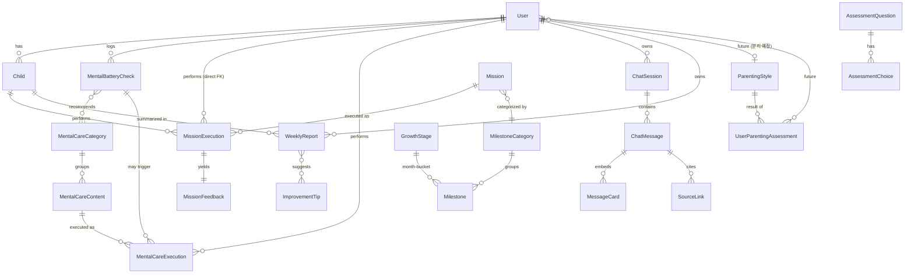
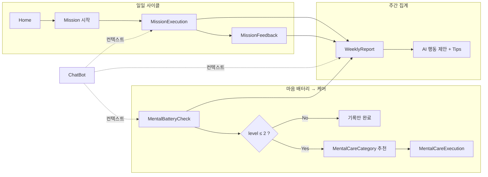

# 육아밸 — 도메인 스키마 초안

> Figma 와이어프레임 (`Wireframe_26.04.29`, node `851:3337`) 기준 도메인 모델 초안.
> 이 문서는 **기획·디자인에서 추출 가능한 데이터 항목**만 정리한다. 구현 시 ERD/DB 컬럼은 별도로 확정.

---

## 도메인 맵

> **메모**: `MissionExecution`은 `User`와 `Child` 양쪽에 직접 FK를 두는 의도적 반정규화 (자녀 단위 집계 + 사용자 단위 집계 모두 빠른 쿼리). `WeeklyReport`도 동일.

### 그룹별 흐름 (요약)

---

## 엔티티 인덱스

> 파일명 prefix는 **유저 플로우 순서**: 온보딩(01-02) → 일일 진입(03) → 콘텐츠 노출(04) → 미션(05) → 마음 케어(06) → 챗봇(07) → 주간 회고(08) → 부가 콘텐츠(09) → 후속 기능(10).

| #   | 영역           | 문서                                             | 주요 엔티티                                                       | 진입 시점       | 상태       |
| --- | -------------- | ------------------------------------------------ | ----------------------------------------------------------------- | --------------- | ---------- |
| 01  | 사용자         | [01-user.md](./01-user.md)                       | `User`                                                            | 온보딩02        | 온보딩     |
| 02  | 자녀           | [02-child.md](./02-child.md)                     | `Child`                                                           | 온보딩03        | 온보딩     |
| 03  | 마음 배터리    | [03-mental-battery.md](./03-mental-battery.md)   | `MentalBatteryCheck`                                              | 멘탈 체크 진입  | 1차        |
| 04  | 발달 로드맵    | [04-roadmap.md](./04-roadmap.md)                 | `MilestoneCategory`, `Milestone`, `GrowthStage`, `PeerInsight`    | 로드맵 진입     | 1차        |
| 05  | 미션           | [05-mission.md](./05-mission.md)                 | `Mission`, `MissionExecution`, `MissionFeedback`                  | 홈 → 시작하기   | 1차        |
| 06  | 마음 케어      | [06-mental-care.md](./06-mental-care.md)         | `MentalCareCategory`, `MentalCareExecution`                       | 배터리 ≤ 2 추천 | 1차        |
| 07  | AI 챗봇        | [07-chat.md](./07-chat.md)                       | `ChatSession`, `ChatMessage`, `MessageCard`, `SourceLink`         | 사용자 트리거   | 1차        |
| 08  | 주간 리포트    | [08-report.md](./08-report.md)                   | `WeeklyReport`                                                    | 주말/주초       | 1차        |
| 09  | 콘텐츠         | [09-content.md](./09-content.md)                 | `ImprovementTip`, `InspirationQuote`, `PeerInsight`               | 여러 화면 회전  | 1차        |
| 10  | 양육 유형 진단 | [10-parenting-style.md](./10-parenting-style.md) | `AssessmentQuestion`, `ParentingStyle`, `UserParentingAssessment` | (마이페이지 등) | **future** |

---

## 표기 규칙

- `*` — 필수 필드 (UI에서 별표 표기 또는 진행 차단)
- `?` — 선택 필드
- `TBD` — 디자인에서 결정되지 않음, 기획·구현 단계 확정 필요
- 출처: `851:6805` 형식의 Figma 노드 ID 기재
- 타입은 TS 기준 표기 (`string`, `number`, `Date`, `enum`, `string[]` 등)

---

## 변경 이력

- 2026-05-02 — Figma 와이어프레임 기준 초안 작성 (41개 화면 추출)
- 2026-05-02 — ASCII 다이어그램 → mermaid 전환, 양육 유형 진단을 [10-parenting-style.md](./10-parenting-style.md)로 분리 (후속 기능)
