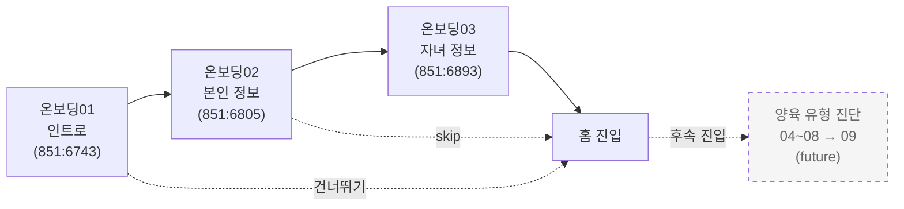

# User — 사용자(부모)

> 워킹맘/대디 본인의 프로필.
> **온보딩에서는 기본 정보만 수집**한다. 양육 유형 진단은 분리됐으며 [10-parenting-style.md](./10-parenting-style.md) 참조.

---

## 온보딩 흐름 (현재 안)

- 온보딩 01 → 02 → 03 만 필수 단계로 운영
- 04~08(5문항) + 09(결과)는 [10-parenting-style.md](./10-parenting-style.md)로 분리, 추후 도입
- 인트로의 "건너뛰기"는 본인 정보까지만 스킵 가능 (자녀 정보는 미션 동작상 필요 — TBD)

---

## 온보딩02 — 입력 필드 명세 (Figma 검증)

> 출처: `851:6805` "온보딩02"
> 화면 헤더: "본인 정보" / "회원님에 대해 알려주세요"

| 라벨                         | 위젯              | 필수 | placeholder / 기본값 | 노드                   |
| ---------------------------- | ----------------- | :--: | -------------------- | ---------------------- |
| 이름 \*                      | Text Input        |  \*  | "홍길동"             | `851:6817`             |
| 생년월일 \*                  | Date Picker       |  \*  | "1992.02.01"         | `851:6822`             |
| 성별 \*                      | Segmented (2 btn) |  \*  | 여성 / 남성          | `851:6828`, `851:6830` |
| 아이와 함께 있는 시간 (평일) | Text Input        |  ?   | "3시간"              | `851:6835`             |
| 아이와 함께 있는 시간 (주말) | Text Input        |  ?   | "3시간"              | `851:6840`             |

> 화면에 **닉네임 입력 필드는 존재하지 않는다**. 이전 초안에 있던 `nickname`은 홈 인사말 "준이맘"(`851:7191`)을 과해석한 것이라 제거함.

---

## User

> 출처: 온보딩02 (`851:6805`)

| 필드               | 타입                                                      | 필수 | 설명                                                                                                  | 출처/메모              |
| ------------------ | --------------------------------------------------------- | :--: | ----------------------------------------------------------------------------------------------------- | ---------------------- |
| `id`               | `string` (UUID)                                           |  \*  | PK                                                                                                    | —                      |
| `name`             | `string`                                                  |  \*  | 실명, 예: "홍길동"                                                                                    | `851:6817`             |
| `birthDate`        | `Date` (yyyy-MM-dd)                                       |  \*  | 생년월일, 예: `1992-02-01`. UI는 Date Picker                                                          | `851:6822`             |
| `gender`           | `enum('female','male')`                                   |  \*  | "여성" / "남성"                                                                                       | `851:6828`, `851:6830` |
| `workStatus`       | `enum('working','full_time_caregiver')?`                  |  ?   | 온보딩 v2 추가. 워킹맘/대디 콘텐츠 분기. 미응답 시 일반 분기                                          | `2010:20364` (v2)      |
| `notificationSlot` | `enum('morning','afternoon','evening','night','custom')?` |  ?   | **온보딩 v3** (2026-05-12). 알림 받을 시간대 단일 선택                                                | `2146:4530` (v3)       |
| `notificationTime` | `string?` (`HH:MM`)                                       |  ?   | **온보딩 v3**. custom일 때 필수, preset일 때 선택(미지정 시 시간대 디폴트)                            | `2146:4530` (v3)       |
| `onboardedAt`      | `DateTime?`                                               |  ?   | 온보딩 완료 시각 1회 기록. null = 미완료. 강제 리디렉션 판단                                          | —                      |
| `parentingStyleId` | `FK → ParentingStyle.id`                                  |  ?   | **온보딩에서 설정 X**. 후속 진단/AI 추론으로 채워짐. [10-parenting-style.md](./10-parenting-style.md) | —                      |
| `createdAt`        | `DateTime`                                                |  \*  | 가입 일시                                                                                             | —                      |
| `updatedAt`        | `DateTime`                                                |  \*  | 갱신 일시                                                                                             | —                      |

> v1의 `weekdayHoursWithChild`/`weekendHoursWithChild`(평일·주말 시간)는 v2에서 `UserAppUsageSlot` 1:N 매트릭스로 대체됐고, v3에서 다시 `notificationSlot`/`notificationTime` 단일 컬럼으로 흡수됐다. 상세: [`../features/20260508-onboarding.md` §3](../features/20260508-onboarding.md).

### 관계 (Relations)

> 표기: `→` outgoing(자식 보유), `←` incoming(부모 참조). DB FK는 자식 쪽에만, 아래는 ORM/문서용 양방향 표기.

- 1:N → `children: Child[]`
- 1:N → `batteryChecks: MentalBatteryCheck[]`
- 1:N → `missionExecutions: MissionExecution[]` _(자녀 경유와 별도로 직접 FK 보유)_
- 1:N → `mentalCareExecutions: MentalCareExecution[]`
- 1:N → `chatSessions: ChatSession[]`
- 1:N → `weeklyReports: WeeklyReport[]`
- N:1 ← `parentingStyle?: ParentingStyle` _(via `parentingStyleId`, **future**)_
- 1:N → `parentingAssessments: UserParentingAssessment[]` _(**future**)_

---

## TBD

- 이메일/소셜 ID 필드 (인증 방식 미정 — Clerk/Auth0 결정 후)
- 푸시 토큰 (Expo 단계에서 추가)
- "3시간" 텍스트 인풋의 입력 형식: 정수만(슬라이더/숫자 키패드) vs 자유 텍스트("3시간"·"3h" 등). 30분 단위(0.5) 허용 여부
- 가입 후 본인 정보 수정 화면(마이페이지) 디자인은 와이어프레임에 미노출 — 추가 필요

---

## 분리된 영역

| 영역           | 위치                                             | 비고                                        |
| -------------- | ------------------------------------------------ | ------------------------------------------- |
| 양육 유형 진단 | [10-parenting-style.md](./10-parenting-style.md) | 5문항 객관식 → 5종 라벨. 후속 기능으로 분리 |
| 자녀 정보      | [02-child.md](./02-child.md)                     | 온보딩03에서 입력                           |
| 마음 배터리    | [03-mental-battery.md](./03-mental-battery.md)   | 멘탈 체크 진입 시 5단계 슬라이더            |
