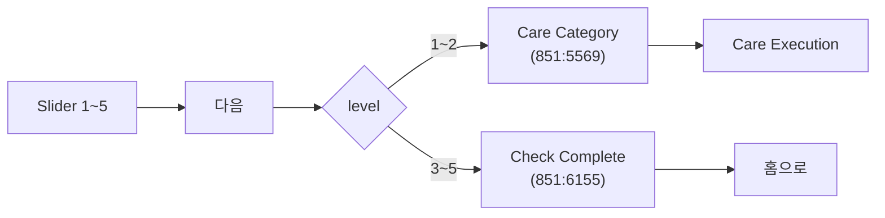

# Mental Battery — 마음 배터리 체크

> 부모 본인의 그날 정서 상태를 5단계로 기록한다.
> 1~2단계(고갈/조금 힘듦) 선택 시 [마음 케어](./06-mental-care.md) 세션이 이어지고, 3~5단계는 기록만 종료된다.

> Figma 검증: 851:5347 (Mental Health Check), 851:6155 (Check Complete), 851:5569 (Care Category)
> ⚠️ 노드 `851:7191`(홈 컨디션 체크 3단계)은 사용하지 않는 화면. 이전 초안의 `DailyConditionCheck` 엔티티는 잘못 추출된 것이라 제거함.

---

## 화면 명세 (Figma 검증)

### Mental Health Check (`851:5347`)

| 요소 | 내용                                              |
| ---- | ------------------------------------------------- |
| 헤더 | "지금 마음의 배터리가 얼마나 남아있나요?"         |
| 본문 | 큰 이모지 + 현재 단계 라벨 (예: "중간 정도 예요") |
| 위젯 | **Slider** (5 stops)                              |
| 단계 | 고갈 / 조금 힘듦 / 중간 / 조금 좋음 / 최고예요!   |
| CTA  | "다음"                                            |

### 분기 흐름

---

## MentalBatteryCheck

| 필드         | 타입               | 필수 | 설명                                                     | 출처       |
| ------------ | ------------------ | :--: | -------------------------------------------------------- | ---------- |
| `id`         | `string`           |  \*  | PK                                                       | —          |
| `userId`     | `FK → User.id`     |  \*  | —                                                        | —          |
| `level`      | `enum(1..5)`       |  \*  | 1=고갈 / 2=조금 힘듦 / 3=중간 / 4=조금 좋음 / 5=최고예요 | `851:5347` |
| `levelLabel` | `string` (derived) |  —   | UI 표시용 한글 라벨                                      | `851:5347` |
| `checkedAt`  | `DateTime`         |  \*  | —                                                        | —          |

### level → 다음 화면 (분기 규칙)

> 분기 정보는 별도 컬럼으로 저장하지 않고 `level`로 결정한다 — 클라이언트 라우팅 + 후속 케어 세션 존재 여부로 충분.

| level | 라벨           | 다음 화면                   |
| :---: | -------------- | --------------------------- |
|   1   | 고갈           | Care Category (`851:5569`)  |
|   2   | 조금 힘듦      | Care Category (`851:5569`)  |
|   3   | 중간 정도 예요 | Check Complete (`851:6155`) |
|   4   | 조금 좋음      | Check Complete (`851:6155`) |
|   5   | 최고예요!      | Check Complete (`851:6155`) |

### 관계 (Relations)

- N:1 ← `user: User` _(via `userId`)_
- 1:N → `triggeredExecutions: MentalCareExecution[]` _(level 1~2에서 시작된 케어 세션. `MentalCareExecution.batteryCheckId`로 역참조)_

---

## TBD

- 하루 N회 체크 가능 여부 (현재 디자인은 하루 1회 묵시적)
- 케어 세션을 시작했지만 즉시 이탈한 케이스 추적 (`MentalCareExecution.status` 기반)
- 슬라이더 기본값(중간) 변경 정책 — 매번 중간으로 리셋 vs 직전 값 유지
