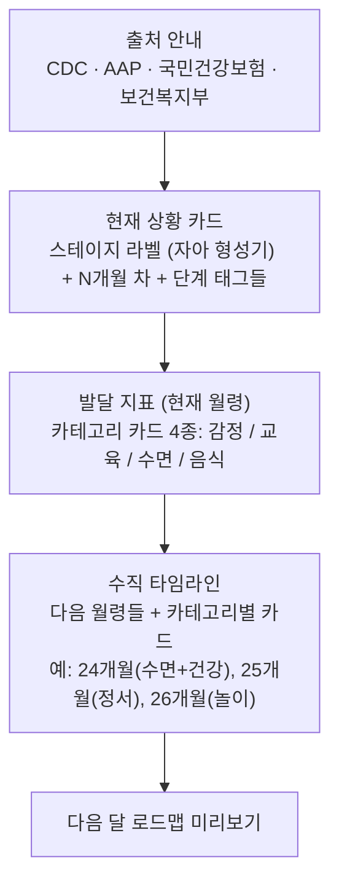
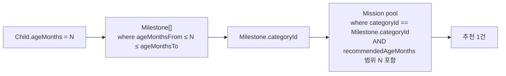

# Roadmap — 발달 로드맵 (월령별 마일스톤)

> "로드맵"은 페이지 이름. 데이터의 핵심은 **월령별 `Milestone`** 이며, 마일스톤의 **카테고리는 미션과 공통 마스터**(`MilestoneCategory`)로 연결된다.

> Figma 검증: ROADMAP_v01 (`851:5028`)

---

## 페이지 구성 (851:5028)

---

## MilestoneCategory (카테고리 마스터)

> 마일스톤·미션이 공유하는 분류 체계. enum이 아니라 **테이블**로 둬서 색상/아이콘 메타와 함께 운영. 디자인에서 카테고리 카드의 색상 배경·아이콘이 일관되게 매핑됨.

| 필드           | 타입     | 필수 | 설명                             | 출처                               |
| -------------- | -------- | :--: | -------------------------------- | ---------------------------------- |
| `id`           | `string` |  \*  | slug. 예: `emotion`, `sleep`     | —                                  |
| `label`        | `string` |  \*  | 한글 표시명, 예: "감정", "수면"  | `851:5028`                         |
| `iconKey`      | `string` |  \*  | 아이콘 식별자 (디자인 토큰 매핑) | `851:5099` 등 카테고리 카드 아이콘 |
| `color`        | `string` |  \*  | 배경 색상 토큰. 예: `#f5d9ff`    | `851:5099` 카드 배경               |
| `displayOrder` | `number` |  \*  | 노출 순서                        | —                                  |

### 시드 (디자인에 노출된 6종)

| id          | label     | 노출 위치 (Figma)                         |
| ----------- | --------- | ----------------------------------------- |
| `emotion`   | 감정/정서 | 7개월차 발달 지표, 25개월 ("정서") — 통합 |
| `education` | 교육      | 7개월차 발달 지표                         |
| `sleep`     | 수면      | 7개월차, 24개월                           |
| `food`      | 음식      | 7개월차                                   |
| `health`    | 건강      | 24개월                                    |
| `play`      | 놀이      | 26개월                                    |

> 디자인의 "감정"과 "정서"는 같은 색상 톤(보라 계열)을 쓰고 있어 **`emotion` 단일 카테고리**로 통합한다. 라벨 표기는 시즈널/맥락에 따라 "감정" 또는 "정서"로 노출 가능.

### 관계 (Relations)

- 1:N → `milestones: Milestone[]`
- 1:N → `missions: Mission[]` _(미션 추천의 핵심 매핑 키)_

---

## Milestone (월령 범위별 발달 마일스톤)

> 이전 명칭 `GrowthIndicator` 폐기. 단일 `ageMonths`가 아닌 **월령 범위(`ageMonthsFrom`~`ageMonthsTo`)** 로 적용 구간을 표현한다.
> 영아기는 1개월 단위로 촘촘하게, 유아기 이후는 여러 개월 묶음으로 운영 가능.

| 필드              | 타입                        | 필수 | 설명                                                       | 출처                 |
| ----------------- | --------------------------- | :--: | ---------------------------------------------------------- | -------------------- |
| `id`              | `string`                    |  \*  | PK                                                         | —                    |
| `categoryId`      | `FK → MilestoneCategory.id` |  \*  | 카테고리 (미션과 공유)                                     | `851:5028`           |
| `ageMonthsFrom`   | `number`                    |  \*  | 적용 월령 하한 (포함). 1개월짜리 마일스톤은 `from == to`   | `851:5028` "24개월"  |
| `ageMonthsTo`     | `number`                    |  \*  | 적용 월령 상한 (포함). `from <= to` 무결성                 | —                    |
| `title`           | `string`                    |  ?   | 짧은 제목. 디자인엔 카테고리 라벨이 제목 역할 → 옵셔널     | TBD                  |
| `description`     | `string`                    |  \*  | 한 단락 가이드                                             | `851:5028`           |
| `sourceCitations` | `SourceCitation[]`          |  ?   | 다중 출처. 한 마일스톤이 여러 자료를 통합한 경우 모두 기록 | `851:5028` 본문 상단 |
| `displayOrder`    | `number`                    |  ?   | 같은 카테고리·범위에 여러 건일 때의 표시 순서              | —                    |

### `SourceCitation` (임베드 객체 — JSON 컬럼)

| 필드       | 타입     | 필수 | 설명                                                      |
| ---------- | -------- | :--: | --------------------------------------------------------- |
| `citation` | `string` |  \*  | 인용 표기. 예: "CDC", "AAP", "국민건강보험", "보건복지부" |
| `url`      | `string` |  ?   | 원문 링크                                                 |
| `note`     | `string` |  ?   | 인용 메모 (페이지·발행연도 등)                            |

### 시드 예시 (월령 범위로 표기)

| from | to  | categoryId  | description                                                                 |
| :--: | :-: | ----------- | --------------------------------------------------------------------------- |
|  7   |  7  | `emotion`   | 특정 애착 물건에 깊은 유대감을 보이기 시작하는 시기입니다.                  |
|  7   |  7  | `education` | 대상 영속성이 형성되는 단계입니다. 지금은 '까꿍 놀이'가 매우 중요해요.      |
|  7   |  7  | `sleep`     | 밤중 수유 종료. 8시간 연속 수면 가능 시기.                                  |
|  7   |  7  | `food`      | 편식이 시작될 수 있어요. 삶은 당근처럼 부드러운 질감을 경험하게 해주세요.   |
|  24  | 30  | `sleep`     | 밤잠이 깊어지는 시기예요. 일관된 수면 의식이 자율성을 높여줍니다.           |
|  24  | 30  | `health`    | 편식이 시작될 수 있어요. 억지로 먹이기보다 다양한 식재료 탐색을 도와주세요. |
|  25  | 27  | `emotion`   | 자신의 감정을 "미워", "싫어"로 표현하기 시작해요. 감정의 이름을 붙여주세요. |
|  26  | 36  | `play`      | 상상 놀이가 풍부해집니다. 인형 놀이를 통해 사회적 상황을 연습해봐요.        |

> 24~30개월 수면 마일스톤처럼 **여러 개월에 걸쳐 동일하게 적용**되는 마일스톤이 가능하다. 자녀가 24·25·26·...·30개월일 때 모두 같은 마일스톤이 매칭된다.

### 무결성 규칙 (스키마 + CMS)

- `ageMonthsFrom <= ageMonthsTo`
- **유니크 제약 없음**: 같은 (`categoryId`, 월령) 조합에 여러 마일스톤이 매칭될 수 있다. 마일스톤 범위는 같은 카테고리 안에서도 **자유롭게 겹칠 수 있음**. 다른 측면을 다루는 경우(예: 24개월 수면 — "수면 시간" + "수면 의식") 둘 다 노출.
- **커버리지 보장 (CMS 검증)**: 운영 대상 월령 구간 `[0, MAX_MONTHS]` × 모든 활성 `MilestoneCategory` 조합에 대해 매칭되는 마일스톤이 **최소 1건 이상** 존재해야 한다. 자녀 월령에 빈 카테고리가 발생하면 안 됨.

### 관계 (Relations)

- N:1 ← `category: MilestoneCategory` _(via `categoryId`)_
- N:1 ← `stage: GrowthStage` _(파생: `ageMonthsFrom`/`ageMonthsTo` 범위 → 단계 매핑, FK 저장 X)_

### 미션 추천 매핑

> 자녀 월령 → 그 월령을 커버하는 마일스톤들 → 각 마일스톤의 `categoryId` → 같은 카테고리의 `Mission` 풀 → 1건 노출.

### TBD

- 운영 월령 상한(`MAX_MONTHS`) 결정 (예: 60개월? 84개월?)
- CMS 검증 방식: 등록·수정 시 사전 체크 vs 일일 배치 검증

---

## GrowthStage (발달 단계 — 월령 그룹 라벨)

> 마일스톤보다 상위 그룹. 디자인의 "현재 상황 [ 자아 형성기 ]" 라벨에 사용.

| 필드            | 타입       | 필수 | 설명                                                                           | 출처                                          |
| --------------- | ---------- | :--: | ------------------------------------------------------------------------------ | --------------------------------------------- |
| `id`            | `string`   |  \*  | slug. 예: `self-formation`                                                     | —                                             |
| `name`          | `string`   |  \*  | 예: "자아 형성기", "정서적 독립기", "감각 탐색"                                | `851:5028`                                    |
| `ageMonthsFrom` | `number`   |  \*  | 적용 월령 하한                                                                 | TBD (디자인 예시 "7개월차")                   |
| `ageMonthsTo`   | `number`   |  \*  | 적용 월령 상한                                                                 | TBD                                           |
| `summary`       | `string`   |  \*  | 단계 설명                                                                      | `851:5028` "아이의 독립심이 싹트고 있어요..." |
| `sideTagIds`    | `string[]` |  ?   | 라벨 옆 태그 칩 (예: "정서적 독립기", "감각 탐색"). 다른 GrowthStage의 id 배열 | `851:5045`, `851:5047`                        |

### 시드 (디자인 노출)

- 자아 형성기 (현재 단계)
- 정서적 독립기
- 감각 탐색

### 관계 (Relations)

- 1:N → `milestones: Milestone[]` _(월령 범위 매칭)_

---

## PeerInsight (또래 인사이트)

> 출처: `851:3866` — "이 시기 부모의 80%가 훈육에 대해 걱정합니다. 당신은 혼자가 아닙니다."

| 필드            | 타입     | 필수 | 설명               |
| --------------- | -------- | :--: | ------------------ |
| `id`            | `string` |  \*  | PK                 |
| `ageMonthsFrom` | `number` |  \*  | 적용 월령          |
| `ageMonthsTo`   | `number` |  \*  | —                  |
| `text`          | `string` |  \*  | 본문               |
| `statPercent`   | `number` |  ?   | 강조 수치 (예: 80) |

홈 화면 한 자리에 1건 회전 노출. **관계 없음** (standalone 마스터).
