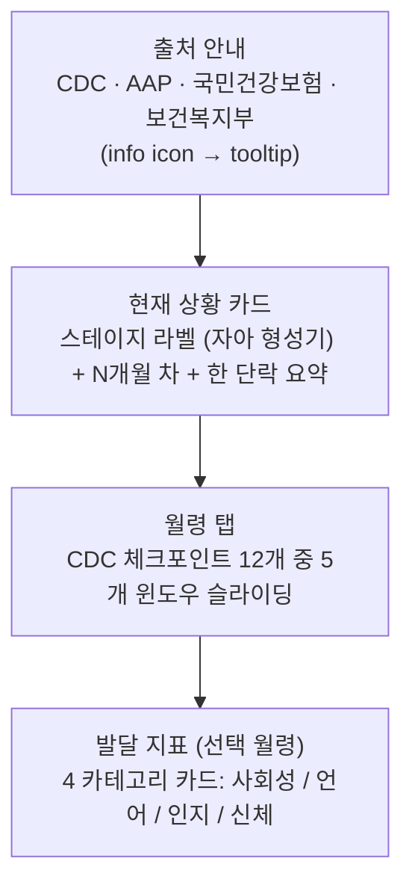
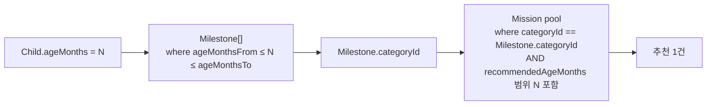

# Roadmap — 발달 로드맵 (월령별 마일스톤)

> "로드맵"은 페이지 이름. 데이터의 핵심은 **월령별 `Milestone`** 이며, 마일스톤의 **카테고리는 미션과 공통 마스터**(`MilestoneCategory`)로 연결된다.

> Figma 검증: ROADMAP_v02 (`2516:5324`, 섹션 `2395:12600`). 구 v01(`851:5028`)은 deprecated — v2 변경 내역은 [`../features/20260523-roadmap.md`](../features/20260523-roadmap.md).

---

## 페이지 구성 (2516:5324)

```mermaid
flowchart TB
    Source["출처 안내<br/>CDC · AAP · 국민건강보험 · 보건복지부<br/>(info icon → tooltip)"]
    Current["현재 상황 카드<br/>스테이지 라벨 (자아 형성기) + N개월 차 + 한 단락 요약"]
    Tabs["월령 탭<br/>CDC 체크포인트 12개 중 5개 윈도우 슬라이딩"]
    Indicators["발달 지표 (선택 월령)<br/>4 카테고리 카드: 사회성 / 언어 / 인지 / 신체"]

    Source --> Current --> Tabs --> Indicators
```

---

## MilestoneCategory (카테고리 마스터)

> 마일스톤·미션이 공유하는 분류 체계. enum이 아니라 **테이블**로 둬서 색상/아이콘 메타와 함께 운영. 디자인에서 카테고리 카드의 색상 배경·아이콘이 일관되게 매핑됨.
>
> **v2 (2026-05-23~)**: 구 6종(emotion/education/sleep/food/health/play, 디자인 노드 `851:5028`) → 신규 4종 CDC Act Early 발달 영역으로 전환. 결정 근거 [`../features/20260523-roadmap.md`](../features/20260523-roadmap.md) §3.1. Figma 신규 디자인 `2516:5324` 기반.

| 필드           | 타입     | 필수 | 설명                                                       | 출처                             |
| -------------- | -------- | :--: | ---------------------------------------------------------- | -------------------------------- |
| `id`           | `string` |  \*  | slug. 4종 enum: `social`/`language`/`cognitive`/`physical` | `2516:5324`                      |
| `label`        | `string` |  \*  | 한글 표시명, 예: "사회성", "신체"                          | `2516:5394`/`5405`/`5416`/`5427` |
| `iconKey`      | `string` |  \*  | 아이콘 식별자 (Figma chip 아이콘)                          | 동상                             |
| `color`        | `string` |  \*  | chip/카드 배경 색상 토큰                                   | 동상                             |
| `displayOrder` | `number` |  \*  | 노출 순서 (디자인 고정 순서)                               | —                                |

### 시드 — CDC Act Early 발달 영역 4종

| id          | label  | iconKey          | color     | displayOrder | 노출 위치 (Figma)                  |
| ----------- | ------ | ---------------- | --------- | :----------: | ---------------------------------- |
| `social`    | 사회성 | `groups`         | `#FFF1D6` |      0       | 로드맵 카드 1 — `2516:5394` (대형) |
| `language`  | 언어   | `dictionary`     | `#E5ECFF` |      1       | 로드맵 카드 2 — `2516:5405`        |
| `cognitive` | 인지   | `psychology_alt` | `#EFE4FF` |      2       | 로드맵 카드 3 — `2516:5416`        |
| `physical`  | 신체   | `barefoot`       | `#D6F5EC` |      3       | 로드맵 카드 4 — `2516:5427`        |

> 구 6종 시드는 폐기. 구 데이터에 있던 `tip` 카테고리(CSV "그 외 (Tip)" 컬럼)는 CDC 4영역에 매핑 부재로 시드/임포트에서 제외. 운영자가 작성한 tip 콘텐츠는 4종 중 가장 가까운 영역으로 수동 재분류 또는 별도 채널로 노출.

### 관계 (Relations)

- 1:N → `milestones: Milestone[]`
- 1:N → `missions: Mission[]` _(미션 추천의 핵심 매핑 키 — v2부터 단일 4종 체계로 통합)_

---

## Milestone (월령 범위별 발달 마일스톤)

> 이전 명칭 `GrowthIndicator` 폐기. 단일 `ageMonths`가 아닌 **월령 범위(`ageMonthsFrom`~`ageMonthsTo`)** 로 적용 구간을 표현한다.
> 영아기는 1개월 단위로 촘촘하게, 유아기 이후는 여러 개월 묶음으로 운영 가능.

| 필드              | 타입                        | 필수 | 설명                                                       | 출처                 |
| ----------------- | --------------------------- | :--: | ---------------------------------------------------------- | -------------------- |
| `id`              | `string`                    |  \*  | PK                                                         | —                    |
| `categoryId`      | `FK → MilestoneCategory.id` |  \*  | 카테고리 (미션과 공유)                                     | `851:5028`           |
| `ageMonthsFrom`   | `number`                    |  \*  | 적용 월령 하한 (포함). 1개월짜리 마일스톤은 `from == to`   | `851:5028` "24개월"  |
| `ageMonthsTo`     | `number`                    |  \*  | 적용 월령 상한 (포함). `from <= to` 무결성                 | —                    |
| `title`           | `string`                    |  ?   | 짧은 제목. 디자인엔 카테고리 라벨이 제목 역할 → 옵셔널     | TBD                  |
| `description`     | `string`                    |  \*  | 한 단락 가이드                                             | `851:5028`           |
| `sourceCitations` | `SourceCitation[]`          |  ?   | 다중 출처. 한 마일스톤이 여러 자료를 통합한 경우 모두 기록 | `851:5028` 본문 상단 |
| `displayOrder`    | `number`                    |  ?   | 같은 카테고리·범위에 여러 건일 때의 표시 순서              | —                    |

### `SourceCitation` (임베드 객체 — JSON 컬럼)

| 필드       | 타입     | 필수 | 설명                                                      |
| ---------- | -------- | :--: | --------------------------------------------------------- |
| `citation` | `string` |  \*  | 인용 표기. 예: "CDC", "AAP", "국민건강보험", "보건복지부" |
| `url`      | `string` |  ?   | 원문 링크                                                 |
| `note`     | `string` |  ?   | 인용 메모 (페이지·발행연도 등)                            |

### 시드 예시 (CDC Act Early 4개월차 — Figma `2516:5324` 본문 발췌)

| from | to  | categoryId  | description                                                                                                                             |
| :--: | :-: | ----------- | --------------------------------------------------------------------------------------------------------------------------------------- |
|  4   |  4  | `social`    | 말을 걸거나 들어 올리면 차분해진다. 상대의 얼굴을 바라본다. 아이에게 다가가면 좋아한다. 아이에게 말하거나 미소를 지을 때 미소를 짓는다. |
|  4   |  4  | `language`  | 울음 소리 이외의 소리를 낸다. 시끄러운 소리에 반응한다.                                                                                 |
|  4   |  4  | `cognitive` | 움직임에 따라 상대를 주시한다. 수 초 동안 장난감을 본다.                                                                                |
|  4   |  4  | `physical`  | 머리를 가눌 수 있다. 엎드린 자세에서 팔에 의지해 머리를 든다.                                                                           |

> 운영 시드는 12 CDC 체크포인트(`2/4/6/9/12/15/18/24/30/36/48/60`) × 4 카테고리 = 48건 기본. CSV로 운영자가 보강한 인접 월령 마일스톤은 `ageMonthsFrom`을 직전 시점, `ageMonthsTo`를 현재 시점으로 cover해 빈 월령이 없도록 함 (`yougabell-api/scripts/import-csv-data.ts`).
>
> 24~30개월처럼 **여러 개월에 걸쳐 동일하게 적용**되는 마일스톤도 가능하다. 자녀가 24·25·26·...·30개월일 때 모두 같은 마일스톤이 매칭된다.

### 무결성 규칙 (스키마 + CMS)

- `ageMonthsFrom <= ageMonthsTo`
- **유니크 제약 없음**: 같은 (`categoryId`, 월령) 조합에 여러 마일스톤이 매칭될 수 있다. 마일스톤 범위는 같은 카테고리 안에서도 **자유롭게 겹칠 수 있음**. 다른 측면을 다루는 경우(예: 24개월 수면 — "수면 시간" + "수면 의식") 둘 다 노출.
- **커버리지 보장 (CMS 검증)**: 운영 대상 월령 구간 `[0, MAX_MONTHS]` × 모든 활성 `MilestoneCategory` 조합에 대해 매칭되는 마일스톤이 **최소 1건 이상** 존재해야 한다. 자녀 월령에 빈 카테고리가 발생하면 안 됨.

### 관계 (Relations)

- N:1 ← `category: MilestoneCategory` _(via `categoryId`)_
- N:1 ← `stage: GrowthStage` _(파생: `ageMonthsFrom`/`ageMonthsTo` 범위 → 단계 매핑, FK 저장 X)_

### 미션 추천 매핑

> 자녀 월령 → 그 월령을 커버하는 마일스톤들 → 각 마일스톤의 `categoryId` → 같은 카테고리의 `Mission` 풀 → 1건 노출.

```mermaid
flowchart LR
    Child["Child.ageMonths = N"] --> M["Milestone[]<br/>where ageMonthsFrom ≤ N ≤ ageMonthsTo"]
    M --> Cat[Milestone.categoryId]
    Cat --> Pool["Mission pool<br/>where categoryId == Milestone.categoryId<br/>AND recommendedAgeMonths 범위 N 포함"]
    Pool --> Pick[추천 1건]
```

### 결정 사항

- `MAX_MONTHS = 84` (2026-05-23, [`../features/20260523-roadmap.md`](../features/20260523-roadmap.md) §7).
- 시드 미존재 월령은 가장 가까운 하단 CDC 체크포인트로 자동 보정 (api `roadmap.service.ts#resolveToCheckpoint`).

### TBD

- CMS 검증 방식: 등록·수정 시 사전 체크 vs 일일 배치 검증

---

## GrowthStage (발달 단계 — 월령 그룹 라벨)

> 마일스톤보다 상위 그룹. 디자인의 "현재 상황 [ 자아 형성기 ]" 라벨에 사용.

| 필드            | 타입       | 필수 | 설명                                                                           | 출처                                          |
| --------------- | ---------- | :--: | ------------------------------------------------------------------------------ | --------------------------------------------- |
| `id`            | `string`   |  \*  | slug. 예: `self-formation`                                                     | —                                             |
| `name`          | `string`   |  \*  | 예: "자아 형성기", "정서적 독립기", "감각 탐색"                                | `851:5028`                                    |
| `ageMonthsFrom` | `number`   |  \*  | 적용 월령 하한                                                                 | TBD (디자인 예시 "7개월차")                   |
| `ageMonthsTo`   | `number`   |  \*  | 적용 월령 상한                                                                 | TBD                                           |
| `summary`       | `string`   |  \*  | 단계 설명                                                                      | `851:5028` "아이의 독립심이 싹트고 있어요..." |
| `sideTagIds`    | `string[]` |  ?   | 라벨 옆 태그 칩 (예: "정서적 독립기", "감각 탐색"). 다른 GrowthStage의 id 배열 | `851:5045`, `851:5047`                        |

### 시드 (디자인 노출)

- 자아 형성기 (현재 단계)
- 정서적 독립기
- 감각 탐색

### 관계 (Relations)

- 1:N → `milestones: Milestone[]` _(월령 범위 매칭)_

---

## PeerInsight (또래 인사이트)

> 출처: `851:3866` — "이 시기 부모의 80%가 훈육에 대해 걱정합니다. 당신은 혼자가 아닙니다."

| 필드            | 타입     | 필수 | 설명               |
| --------------- | -------- | :--: | ------------------ |
| `id`            | `string` |  \*  | PK                 |
| `ageMonthsFrom` | `number` |  \*  | 적용 월령          |
| `ageMonthsTo`   | `number` |  \*  | —                  |
| `text`          | `string` |  \*  | 본문               |
| `statPercent`   | `number` |  ?   | 강조 수치 (예: 80) |

홈 화면 한 자리에 1건 회전 노출. **관계 없음** (standalone 마스터).
