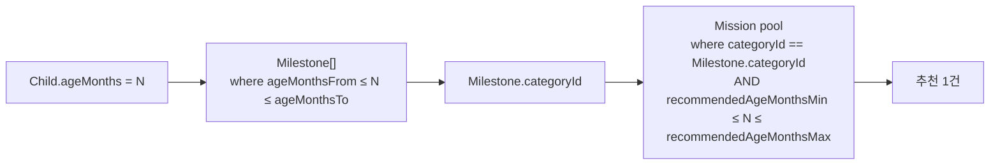
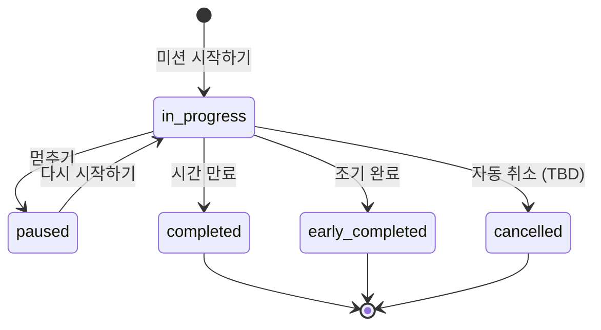

# Mission — 미션, 수행, 피드백

> "10분 미션" 단위로 부모-아이 상호작용을 유도하고, 수행 후 피드백을 수집해 다음 미션과 주간 리포트에 반영한다.

---

## Mission (미션 마스터)

> 출처: Mission Detail (`851:3340`), Mission Home (`851:3410`)

| 필드                      | 타입                        | 필수 | 설명                                                                     | 출처                             |
| ------------------------- | --------------------------- | :--: | ------------------------------------------------------------------------ | -------------------------------- |
| `id`                      | `string`                    |  \*  | PK                                                                       | —                                |
| `categoryId`              | `FK → MilestoneCategory.id` |  \*  | 마일스톤과 공통 카테고리. 예: `emotion`, `play`, `sleep`                 | [04-roadmap.md](./04-roadmap.md) |
| `title`                   | `string`                    |  \*  | 카드 제목, 예: "아이와 10분 가까워지기"                                  | `851:3340`                       |
| `shortTitle`              | `string`                    |  \*  | 상세 페이지 헤더, 예: "10분 아이컨텍"                                    | `851:3340`                       |
| `description`             | `string`                    |  \*  | 상세 본문                                                                | `851:3340`                       |
| `durationMinutes`         | `number`                    |  \*  | 예: 10, 7. 타이머 계산의 기준 분 단위                                    | `851:3340`, `851:4603` "7분"     |
| `effect`                  | `string`                    |  \*  | 카피, 예: "정서적 안정감"                                                | `851:3340`                       |
| `subThemeLabel`           | `string`                    |  ?   | UI 상단 칩에 노출되는 보조 라벨. 예: "아이와 가까워지기" (카테고리 아님) | `851:3410`                       |
| `tags`                    | `string[]`                  |  ?   | 검색·필터용                                                              | TBD                              |
| `recommendedAgeMonthsMin` | `number`                    |  ?   | 적정 월령 하한 (마일스톤 ageMonths와 매칭)                               | TBD                              |
| `recommendedAgeMonthsMax` | `number`                    |  ?   | 적정 월령 상한                                                           | TBD                              |
| `thumbnailUrl`            | `string`                    |  ?   | 카드·리스트에 노출되는 정적 섬네일 이미지 URL                            | TBD (콘텐츠 운영 요건)           |
| `videoUrl`                | `string`                    |  ?   | 가이드 영상이 있는 미션의 영상 URL. 카드 섬네일은 `thumbnailUrl` 사용    | TBD (콘텐츠 운영 요건)           |
| `createdAt`               | `DateTime`                  |  \*  | —                                                                        | —                                |

> **카테고리 정책 변경**
> 이전 `category: string` ("아이와 가까워지기" 등 자유 텍스트)을 폐기하고 `categoryId: FK → MilestoneCategory.id`로 변경. 마일스톤·미션이 같은 마스터를 참조해야 추천 매칭이 가능. 기존 "아이와 가까워지기" 같은 라벨은 미션의 sub-테마로서 `subThemeLabel`(옵셔널)에 보존.

### 관계 (Relations)

- N:1 ← `category: MilestoneCategory` _(via `categoryId`)_
- 1:N → `executions: MissionExecution[]`

### 추천 로직 (categoryId 매칭 + 월령 범위)



> 마일스톤이 한 자녀 월령에 여러 건 매칭될 수 있으므로(유니크 제약 없음), 미션도 여러 카테고리에 걸쳐 풀이 형성될 수 있다. 최종 1건 선택 정책(랜덤·점수·순환 등)은 TBD.

**메모**

- 다자녀: 같은 미션이 자녀별로 다른 진척도를 가질 수 있다 → `MissionExecution`이 `childId`를 가짐
- 추천 가중 신호 (TBD): `User.parentingStyleId` (future), `MentalBatteryCheck.level` (저배터리면 짧은 미션 우선)

---

## MissionExecution (수행 인스턴스)

> 출처: Mission Timer (`851:5197`), Mission Timer Resume (`851:5266`), Mission Home_complete (`851:3488`)

| 필드                     | 타입                                                                     | 필수 | 설명                                                                               | 출처                                                                    |
| ------------------------ | ------------------------------------------------------------------------ | :--: | ---------------------------------------------------------------------------------- | ----------------------------------------------------------------------- |
| `id`                     | `string`                                                                 |  \*  | PK                                                                                 | —                                                                       |
| `userId`                 | `FK → User.id`                                                           |  \*  | —                                                                                  | —                                                                       |
| `childId`                | `FK → Child.id`                                                          |  \*  | 어떤 아이와 수행했는지                                                             | `851:3866`                                                              |
| `missionId`              | `FK → Mission.id`                                                        |  \*  | —                                                                                  | —                                                                       |
| `status`                 | `enum('in_progress','paused','completed','early_completed','cancelled')` |  \*  | —                                                                                  | `851:5197` "멈추기", `851:5266` "다시 시작하기", `851:5197` "조기 완료" |
| `startedAt`              | `DateTime`                                                               |  \*  | 최초 시작 시각                                                                     | —                                                                       |
| `activeSegmentStartedAt` | `DateTime`                                                               |  ?   | 현재 진행 중 segment 시작 시각. `in_progress`일 때만 값이 있다                     | 타이머 복구용                                                           |
| `pausedAt`               | `DateTime`                                                               |  ?   | 마지막 일시정지 시각. `paused`일 때만 값이 있다                                    | 타이머 복구용                                                           |
| `elapsedSeconds`         | `number`                                                                 |  \*  | 현재 segment를 제외하고 누적 저장된 진행 시간(초). pause/resume 복구의 기준값      | 타이머 복구용                                                           |
| `completedAt`            | `DateTime`                                                               |  ?   | 종료 시각                                                                          | —                                                                       |
| `actualDurationSeconds`  | `number`                                                                 |  ?   | 최종 실제 수행 시간. `completed`면 보통 전체 시간, `early_completed`면 중간 종료값 | 타이머 `851:5197` "09:44"                                               |
| `wasEarlyCompleted`      | `boolean`                                                                |  \*  | 디폴트 false                                                                       | `851:5197`                                                              |

### 상태 전이



### 관계 (Relations)

- N:1 ← `user: User` _(via `userId`)_
- N:1 ← `child: Child` _(via `childId`)_
- N:1 ← `mission: Mission` _(via `missionId`)_
- 1:1 → `feedback?: MissionFeedback`

**TBD**

- 타이머 시작 후 X분 이상 비활동 시 자동 cancel 정책

### 타이머 복구 계산 규칙

- 미션 총 시간(초) = `Mission.durationMinutes * 60`
- `in_progress`일 때 현재 누적 진행 시간:

```text
elapsedSeconds + (now - activeSegmentStartedAt)
```

- `paused`일 때 현재 누적 진행 시간:

```text
elapsedSeconds
```

- 남은 시간:

```text
Mission.durationMinutes * 60 - currentElapsedSeconds
```

- `pause` 시:
  - `elapsedSeconds += now - activeSegmentStartedAt`
  - `activeSegmentStartedAt = null`
  - `pausedAt = now`
  - `status = 'paused'`
- `resume` 시:
  - `activeSegmentStartedAt = now`
  - `pausedAt = null`
  - `status = 'in_progress'`

> `startedAt`만으로는 pause/resume 이후 정확한 남은 시간을 복구할 수 없으므로, `elapsedSeconds`와 `activeSegmentStartedAt`를 함께 저장한다.

---

## MissionFeedback (피드백)

> 출처: Praise & Mission Feedback_v001 (`851:3566`), Mission Feedback_v003 (`851:3647`)
> v001은 단일 5점 척도, v003은 3축 5점 + 키워드 입력. **v003을 정식 안으로 채택**한다.

| 필드                  | 타입                                   | 필수 | 설명                                                  | 출처       |
| --------------------- | -------------------------------------- | :--: | ----------------------------------------------------- | ---------- |
| `id`                  | `string`                               |  \*  | PK                                                    | —          |
| `executionId`         | `FK → MissionExecution.id` (`@unique`) |  \*  | —                                                     | —          |
| `childReaction`       | `enum(1..5)`                           |  \*  | 매우 부정 / 부정 / 중간 / 조금 긍정 / 매우 긍정       | `851:3647` |
| `parentEnergy`        | `enum(1..5)`                           |  \*  | 매우 지침 / 조금 지침 / 보통 / 조금 충전 / 매우 충전  | `851:3647` |
| `missionSatisfaction` | `enum(1..5)`                           |  \*  | 매우 불만족 ~ 매우 만족                               | `851:3647` |
| `childKeywords`       | `string[]`                             |  ?   | 아이가 가장 많이 한 단어. 예: ["공룡", "엄마 사랑해"] | `851:3647` |
| `note`                | `string`                               |  ?   | 자유 텍스트 (선택)                                    | `851:3566` |
| `createdAt`           | `DateTime`                             |  \*  | —                                                     | —          |

### 관계 (Relations)

- 1:1 ← `execution: MissionExecution` _(via `executionId`)_

### 활용

- `childKeywords` → 주간 리포트의 "관심 키워드 Top 3" 집계 (`851:6618`)
- `childReaction` → "아이 반응 긍정률" 집계
- `parentEnergy` → "사용자의 내면 상태" 집계 + 다음 미션 난이도 조절

**TBD**

- v001의 칭찬/리액션 화면(`851:3811`)이 v003에서도 노출되는지 (수행 직후 칭찬 → 피드백 폼 순서)
- 키워드 자동 추천(태그 클라우드)을 줄지, 자유 입력만일지
